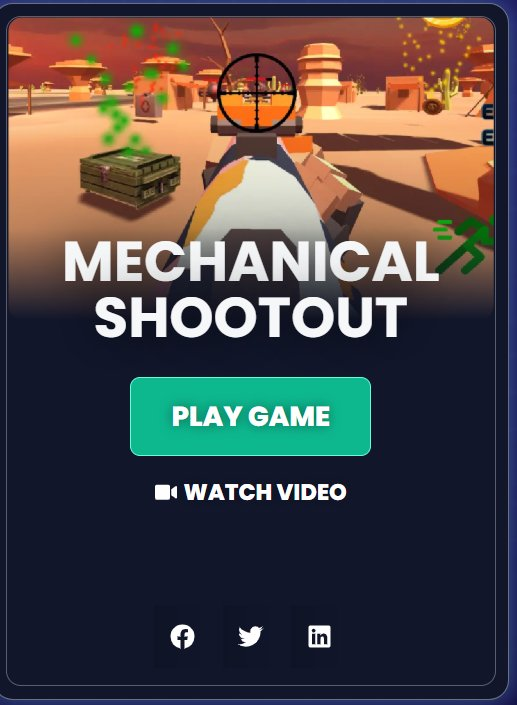
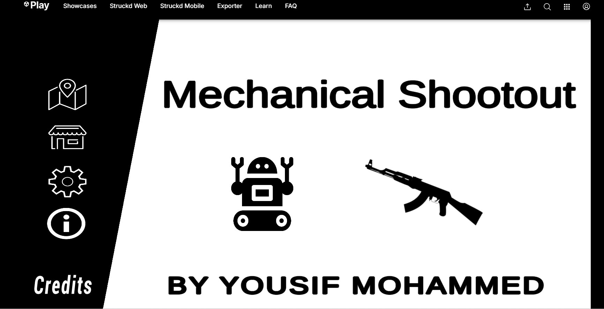
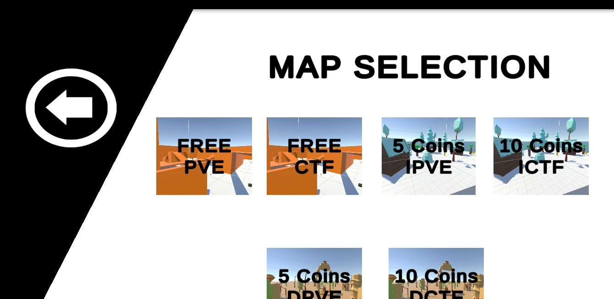
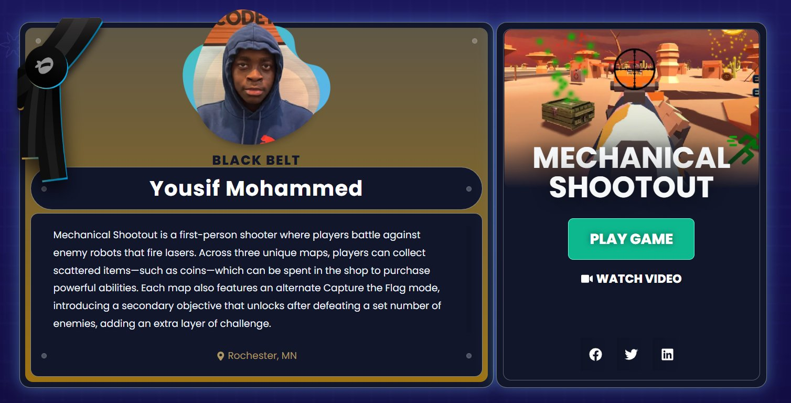

# 🤖 Mechanical Shootout

> A first-person shooter where humans fight back against robot invaders — built in Unity as a Code Ninjas Black Belt Capstone Project.

<p align="center">
  
</p>

<p align="center">
  
</p>

---

## 🎮 Play It Now

**[▶ Play Mechanical Shootout on Unity Play](https://play.unity.com/en/games/9bf64c52-225b-4623-9caf-61040ecdf121/mechanical-shootout)**

**[📺 Watch the Trailer](https://youtu.be/_cOdvzL_NY8)**

---

## 📖 About the Game

Mechanical Shootout is a first-person shooter where players battle against enemy robots that fire lasers. Across six unique maps, players can collect scattered items—such as coins—which can be spent in the shop to purchase powerful abilities. Each map also features an alternate Capture the Flag mode, introducing a secondary objective that unlocks after defeating a set number of enemies, adding an extra layer of challenge.

### Key Features
- 🤖 **Enemy AI** — Robots that track and shoot at the player
- 🗺️ **6 Unique Maps** — Three environments each with a PVE and CTF variant
- 🏳️ **Capture the Flag Mode** — An alternate objective that unlocks after defeating a set number of enemies
- 🪙 **Item Collection & Shop** — Collect coins scattered across maps and spend them on powerful abilities
- 🎯 **Player Controls** — Smooth FPS movement and shooting mechanics

---

## 🗺️ Maps

<p align="center">
  
</p>

The game features **6 maps** across 3 distinct environments, each available in two modes:

| Map | Mode | Coins Required |
|-----|------|---------------|
| Desert | Free PVE | Free |
| Desert | Free CTF | Free |
| Ice | IPVE | 5 Coins |
| Ice | ICTF | 10 Coins |
| Desert City | DPVE | 5 Coins |
| Desert City | DCTF | 10 Coins |

---

## 🛠️ Built With

| Tool | Purpose |
|------|---------|
| Unity | Game engine |
| C# | Game logic & scripting |
| Unity Play | Publishing & hosting |

---

## 🏆 About This Project

This game was built as my **Black Belt Capstone Project** at Code Ninjas — the final milestone after completing all 7 belt levels over 5 years. It represents everything I learned about game development, programming, and problem-solving.

**Featured on the [Code Ninjas Black Belt Blog](https://blog.codeninjas.com/black-belt-ninja/yousif-mohammed/)**

---

## 🏅 Featured by Code Ninjas

<p align="center">
  
</p>

Officially recognized as a **Code Ninjas Black Belt** graduate and featured on the Code Ninjas platform for Mechanical Shootout.

---

## 👤 Developer

**Yousif Suliman**
- 10th Grade @ Century High School, Rochester, MN
- Code Ninjas Black Belt Graduate
- Skills: C#, Python, JavaScript, Unity, Machine Learning, Generative AI
- [LinkedIn](https://www.linkedin.com/in/yousif-suliman) <!-- Update with your actual LinkedIn URL -->

---

## 📁 Project Structure

```
mechanical-shootout/
├── Assets/
│   ├── Scripts/       # C# game logic
│   ├── Scenes/        # Game maps/levels
│   ├── Prefabs/       # Reusable game objects
│   └── UI/            # Shop, HUD, menus
├── screenshots/
│   ├── Mechanical-shootout-1.png
│   ├── Mechanical-shootout-2.png
│   ├── Mechanical-shootout-3.png
│   └── maps-selection.png
├── ProjectSettings/
└── README.md
```

---

## 🚀 Running Locally

1. Clone this repo
2. Open in **Unity** (recommended version: [add your Unity version here])
3. Open the `Assets/Scenes/` folder and load the main scene
4. Hit **Play** in the Unity Editor

---

*Made with 💻 + ☕ by Yousif Suliman — Code Ninjas Black Belt, 2024*
